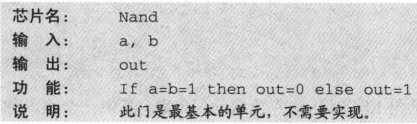

# Gate Logic

使用逻辑门实现布尔函数

逻辑门是一个单独的芯片

## HDL

对门的静态描述

保证HDL代码时自我描述和可读的(self-descriptive and readable)

hdl中的`=`表示连接，而不是赋值

```
CHIP Xor {
  IN a, b;
  OUT out;

  PARTS:
  Not (in = a, out = nota);
  Not (in = b, out = notb);
  And (a = a, b = notb, out = aAndNotb);
  And (a = nota, b = b, out = notaAndb);
  Or = (a = aAndNotb, b = notaAndb, out = out);
}
```

## Nand

Nand门（与非门）是最原始的门，其它门都是由该门构建的。



```js
|   a   |   b   |  out  |
|   0   |   0   |   1   |
|   0   |   1   |   1   |
|   1   |   0   |   1   |
|   1   |   1   |   0   |
```
