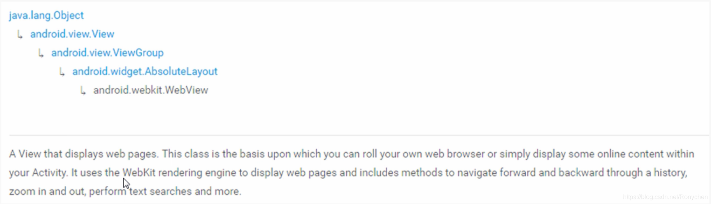

# webview是什么？

- 首先它继承自view，他是一个view，所以他可以在Activity中方便的嵌入
- 他是一个基于webkit的引擎，可以解析DOM元素，展示HTML页面的控件，他和浏览器
展示页面的原理是相同的，所以把他当做浏览器来看待

webview的作用即用于手机系统来展示html界面的，所以它主要在需要手机系统上加载
HTML文件时被需要。

webview是dom renderer + js runtime
