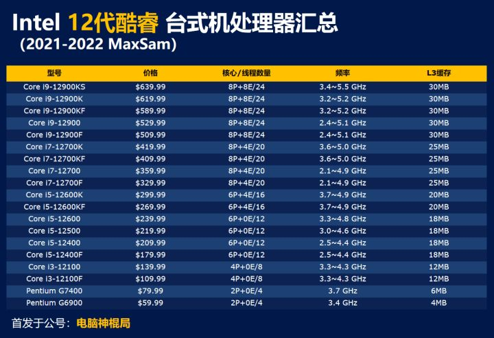
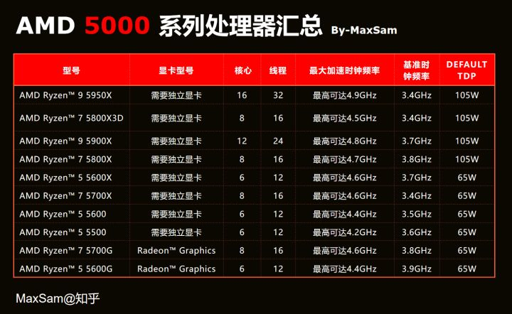
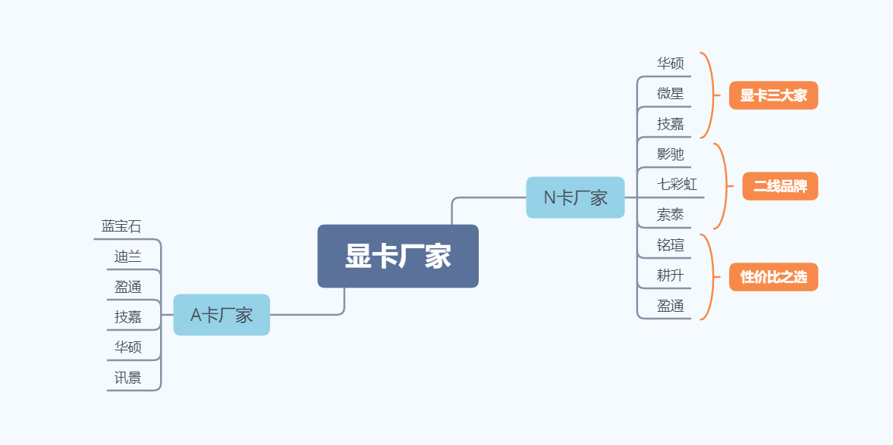
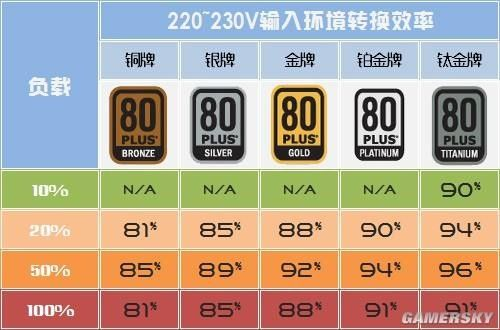
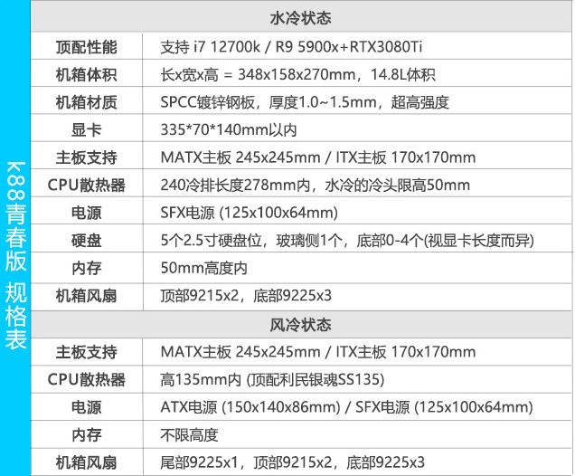
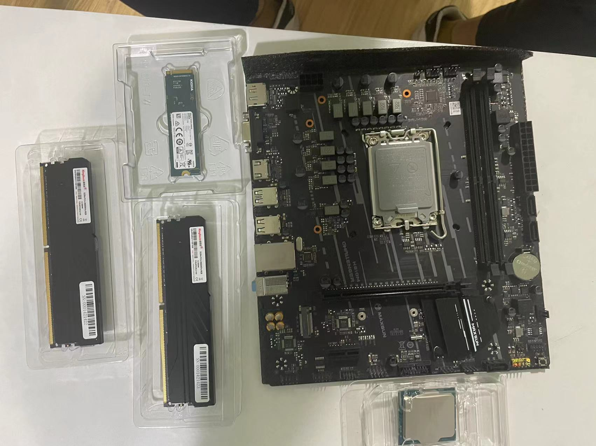
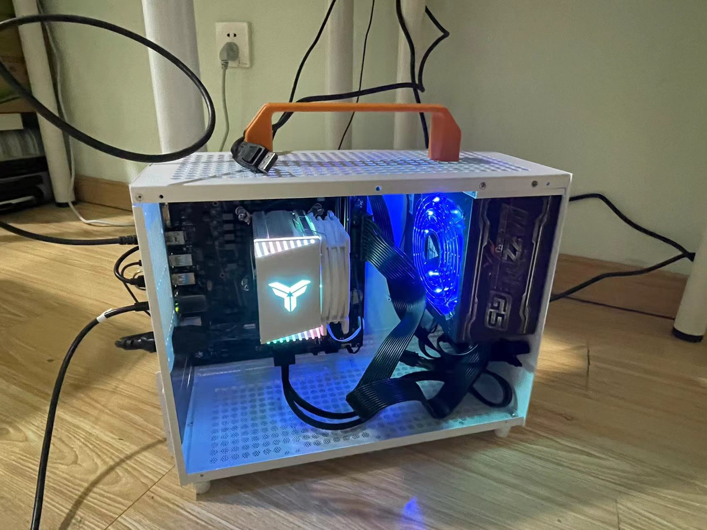

# 如何 DIY 电脑主机

## 组装电脑需要的硬件都有哪些？

组装一台所需要的的配件主要有8个：CPU，主板，显卡，内存，硬盘，电源，散热，机箱。这8个配件是必要组件，
当你有了这8个配件的时候，一台电脑就能开机了。可能你会问，为什么没有显示器，键盘鼠标这些，因为他们是于外设。

## CPU

以`Core i5 12400F`举例

- Core: 系列名称，有至强、酷睿、赛扬、奔腾、凌动……
- i5: CPU定位，分为 i3，i5，i7 和 i9 分别是低端，中端，中高端，高端。（不能仅通过`i`几判断`CPU`的性能，要看具体型号）
- 12: 表第几代，这里就是第十二代
- 400: 代表级别，一般来说，其他都相同的情况下，数字越大，性能越强
- F: 代表特性后缀, 分为笔记本和台式机

| 后缀 | 含义 |
| --- | --- |
| X/XE | 代表顶级至尊皇帝版CPU |
| K | 代表开放倍频以供用户超频，即不锁频，可超频 |
| S/T | 代表节能版CPU，功率相较于不带后缀的略低，相应的频率也降低 |
| R | 代表该CPU采用了当代性能最高核显，常出现在一体机和迷你主机上，无法更换和升级 |
| C | 只出现在5代CPU中，CPU性能有所退步，但有最强集显CPU性能 |
| F | 代表无核显的CPU，需搭配独立显卡，这种CPU功耗小，发热低，价格也稍低 |

### 超频是什么意思？

CPU超频就是通过使用人为的方法将CPU运行速率得到大幅度提升，让原来处理能力一般的CPU获得更高层次的处理运算能力。
由于一般厂家为了CPU安全，会让频率设定在比较稳定的范围之内，而CPU超频就是超过这个稳定界定的区域，来让CPU进行工作。

### 在购买CPU之前有几个问题需要注意

1. 是否需要超频？

一般工作和生活并不需要超频，超频很多时候是一些电脑DIY爱好者所追求的一种挑战和爱好，或者是一些对CPU频率要求很高的工作场景
下才使用的手段，而超频也有一定的副作用，功耗高，热量大，电脑不稳定等。辛辛苦苦超半年，不如人家Intel多挤一点牙膏。

2. 散片和盒装买哪个？

散片和盒装在质量上并无太大不同，区别在于盒装是带有原装散热风扇，而散片只有一个CPU。一般建议有经验的用户买散片，但是如果是
新手或者对散片持怀疑态度的用户可以买盒装，盒装售后和保修具有一定的优势。毕竟散片一般会比较便宜。

3. 有核显版本和无核显版本怎么选？

这个问题一般Intel用户比较常见，如果自己有独立显卡，不建议买核显版本。因为核显基本用不到了，无核显版本能省一部分资金。

4. AMD和Intel该如何选择？

AMD和Intel目前来说各有优势。
纯粹游戏用户和部分计算机专业用户选Intel，过一段时间5000系列价格稳定以后，游戏用户也可以选择AMD了。
生产力工具，主要为视频剪辑等对多核心多线程有需求的工作选择AMD，AMD在多核心多线程方面的优势胜于Intel。

5. i7一定比i5好吗？买CPU一定要买高端的吗？

i7不一定强于i5，一般淘宝的卖家喜欢用i7等字眼来标榜自己的主机。但是i7很重要，是几代CPU更重要。所以在购买CPU和电脑之前，
查一下具体参数型号很重要。

## 显卡

显卡和CPU一样，有两个主要的芯片厂商，AMD和NVDIA，但是显卡的品牌很多。这些品牌多是从AMD和NVDIA买进显卡芯片自己在组装
产品卖出的，他们生产的显卡被称为非公版显卡。而AMD和NVDIA生产的显卡被称为公版显卡，一般而言大多数人选择非公版显卡，一方
面价格有更多的选择，另一方面显卡的外观，用料，散热等也让用户有更多的选择。

### 显卡厂商

显卡性能参考[显卡天梯图](https://www.mydrivers.com/zhuanti/tianti/gpu/index.html)

### 显卡的几个重要参数

1. 流处理器

首先是流处理器，流处理器的作用就是接收处理数据流和传送数据流。相当于显卡这个画画工厂中的画师数量，流处理器越多，
那么接收和传送数据流的速度越快，显卡的性能也就越强。这和工厂中画师越多，工厂的工作效率和产量越高一个道理。

2. 显卡架构

显卡架构可以理解为工厂的管理模式和生产模式，流水线式的生产肯定要比小作坊更加有效率，目前显卡的主要架构为3080系
采用的安培架构，和20系采用的图灵架构。

3. 显卡的核心频率

显卡的核心频率和CPU的核心频率基本是相似的，相当于显卡这个工厂的工作效率，工作效率越高，那么显卡处理数据的速度也
是越快的。显卡核心频率也是可以超频的，但是各个显卡厂家推出了OC版本，就是超频版本，一般要比普通版本贵1-200元。

4. 显存容量，位宽，显存频率

显存就是存储显卡处理好或者即将调用的数据信息的地方，而显存容量就是显存能够缓存数据的容量大小，相当于一个仓库的大小。
显存位宽则是，数据传输时每次传输数据的大小，相当于在工厂和仓库之间运输车的大小，更大的显存位宽，每次传输的数据量更大，
那么传输数据的时间就会更短。

而显存频率则是固定时间内，数据传输的次数，就相当于运输车的通勤次数。

这里需要注意的是大显存并不代表显卡的性能强悍，某宝的商家经常用大显存作为显卡和整机的宣传卖点，这样很容易误导小白，
衡量一个显卡的好坏，要从显卡的各个参数综合考量。

以 `NVIDIA GeForce RTX 3080 TI` 举例：

- GeForce：显卡系列名称，有 GeForce，Quadro，TITAN……
- RTX：代表显卡定位，GTX 代表高端，GTS 代表中端，GT 代表低端，RTX 代表新一代高端（搭载光线追踪技术）
- 30：代表的是第几代,这张显卡就是第十二代显卡，越高性能越强。
- 8：则是显卡性能档次的定位，数字越高在这一代里性能就越强。
- TI：代表特殊版本，TI是增强版，Super 代表小幅增强版，SE 削弱版，M 是移动版（笔记本）如 MX，Max-Q，没有后缀则代表普通版

### 为啥挖矿要用显卡，而不用CPU？

首先，CPU可以用来挖矿，最开始都是用CPU挖，但是随着对挖矿算法的深入研究，大家发现原来挖矿都是在重复一样的工作，而CPU作为
通用性计算单元，里面设计了很多诸如分支预测单元、寄存单元等等模块，这些对于提升算力是根本没有任何帮助的。

另外，CPU根本不擅长于进行并行运算，一次最多就执行十几个任务，这个和显卡拥有数以千计的流处理器差太远了，显卡高太多了，
因此大家慢慢针对显卡开发出对应的挖矿算法进行挖矿。

以BTC为例，它最基本的算法原理就是，把已有的10分钟内的所有交易作为一个输入，加上一个随机数，当10分钟内所有交易记录加上
你的这个随机数计算出一个SHA256的hash。里面几乎都是整数运算，这个根本就像是为显卡特别打造一样，显卡非常适合这种无脑性算法，
流处理器数目越多约占优势。

就Hash计算而言，它几乎都是独立并发的整数计算，GPU简直就是为了这个而设计生产出来的。相比较CPU可怜的2-8线程和长度惊人的控制
判断和调度分支，GPU可以轻易的进行数百个线程的整数计算并发（无需任何判断的无脑暴力破解乃是A卡的强项）。

## 主板

主板是三大件中最容易被忽视的一个（CPU显卡主板合称三大件），主板的作用就像一个躯干，所有的配件都在主板上有一席之地。
更像一个连接桥梁，每个配件通过主板进行连接，传输数据。主板厂家分别为华硕，技嘉，微星，华擎，映泰，七彩虹，影驰等。
其中华硕，技嘉，微星被称为三大家，也是用户选择最多的品牌。

另外主板并不是简简单单的一块板，为了做好桥梁的工作，它有自己的系统，就是BIOS。关于主板的各项设置都在BIOS中。
接下来讲一下主板的几个重要参数：

1. 主板芯片组

主板芯片组一般是CPU厂家设计生产的。
AMD的芯片组为A320,B450,B550,X470,X570。搭载这些芯片组的主板适用于AMD的CPU。其中A320搭载入门级CPU，B450,
550搭载中高端，X470和X570则是高端和顶级CPU的座驾。

Intel的芯片组为H510,H610,B560,B660,Z590,Z690。搭载这些芯片组的主板适用于Intel的CPU，其中H510和H610主要
用来搭配入门级CPU，而B560，B660用于搭载不超频的中高端CPU，而Z590，Z690用于搭载超频的中高端CPU。

2. 主板供电

主板供电也是衡量一个主板品质高低的重要标准。CPU等级越高，对供电的要求就更高，而需要的超频的CPU对供电要求则会更高。
所以在选择主板的时候还要注意主板的供电能力。

3. 主板接口

主板上接口众多，但是没有一个多余的。

硬件接口包括：CPU插座、内存插槽、显卡插槽、M.2插槽、SATA插槽、其他PCIE插槽、风扇接口。

电源接口包括：CPU 4+4Pin供电、主板24Pin供电、PCIE辅助供电。

机箱前置接口：开机重启键及硬盘指示灯、USB2.0接口、USB3.0接口、音频接口。

后置I/O接口：USB接口、视频接口、网线接口、音频接口。

4. 主板大小型号

一般主板大小分为E-ATX,ATX,M-ATX,MINI-ATX四种。

E-ATX 加强型：高性能主板，一般会有 8 个内存插槽，芯片组都是 X 系列等级的，适合使用带 X 后缀的处理器，
但是价格很高，不推荐普通用户使用。

ATX 标准型：俗称“大板”，体型稍大，扩展性好，接口全，一般内存都是四插槽起，2 或 3 个 PCIe 接口和 M.2 接口，
是现在用的最多的主板类型。

M-ATX 紧凑型：俗称“小板”，体型接近正方形，内存插槽一般是两个或者四个，会有一个 M.2 接口，扩展性虽然不高，
但是可以满足大多数用户的需求。

mini-ITX 迷你型：迷你主板，接口数量属于日常刚好够用的水平，适合 ITX 迷你机箱，一般用来办公或者家用，不适合做游戏主机。

不同大小的主板在选择机箱上有所不同这也是需要注意的。

所以在主板的选择方面，还是要根据CPU的型号规格来有的放矢。同时，在选择主板的时候，尽量不要选择各厂家的丐版主板。
用户选择比较多的主板为微星军火库系列，最有名的为迫击炮系列，华硕的ROG和TUF系列。

另外：主板和CPU一起买，往往会便宜

### Intel 主板

- H 系列：入门级，不支持超频，价格比较便宜，适合一般家用电脑；
- B 系列：主流级，不支持超频，可扩展能力强大，性价比很高；
- Z 系列：中高端，支持超频，搭配的 CPU 一般带有 “K” 字母后缀；
- X 系列：最高级，用来搭配高端 CPU，CPU 型号后缀有 “X” 字母。

## 内存

内存之所以叫内存（RAM），是因为有外存（固态硬盘，硬盘，移动硬盘，U盘）。内存的主要作用是暂时存放CPU中的运算数据，
与硬盘等外部储存器交换的数据。

内存颗粒厂家主要有海力士，镁光，三星，南亚四家，最近光威国产内存颗粒上市，国货逐渐追赶了上来。而内存贴牌厂家众多，
其中最推荐的内存品牌包括：铂胜，科赋，光威，金士顿骇客神条系列，芝奇幻光戟，皇家戟，威刚部分系列。

而内存条除了颗粒的区别外，还有DDR版本区别，目前最常用的为DDR4，而内存的频率分别为，2666，3000，3200和3600。
部分超频性能较好的内存可以超频至4000甚至更高。

内存频率是不是越高越好？

内存频率对游戏和电脑性能有一定影响。

是否要组双通道？

双通道就是在一台机器上同时插2根内存大小相同的内存条，双通道对于电脑性能和游戏性能来说，提升很明显。
在购买时建议大家购买双8G或者双16G内存。

### 内存频率原理

计算机系统的时钟速度是以频率来衡量的。晶体振荡器控制着时钟速度，在石英晶片上加上电压，其就以正弦波的形式震动起来，
这一震动可以通过晶片的形变和大小记录下来。晶体的震动以正弦调和变化的电流的形式表现出来，这一变化的电流就是时钟信号。
而内存本身并不具备晶体振荡器，因此内存工作时的时钟信号是由主板芯片组的北桥或直接由主板的时钟发生器提供的，
也就是说内存无法决定自身的工作频率，其实际工作频率是由主板来决定的

## 硬盘

在硬盘方面，现在主流的硬盘位固态硬盘和机械硬盘。多数情况下，建议用户配置一个固态硬盘用作系统盘，以及将一些重要的游戏
和软件放在固态硬盘里。主要原因是固态硬盘的读取速度比机械硬盘快很多，当然在快的同时，价格也是贵了很多

关于硬盘的知识点算是比较多，但是用户需要记住的一些比较常用就好。

- 固态硬盘的接口最常用的是M.2，PCIE,SATA接口，在选择上M.2接口优于SATA和PCIE接口。
- 固态硬盘协议有两种，NVME和SATA，在选择上NVME协议优于SATA。
- 固态硬盘也有颗粒之分，原厂颗粒厂家包括Intel，三星，镁光，海力士，闪迪，东芝，长江储存。
- 市面上比较好的固态硬盘品牌包括，Intel，三星，闪迪，西数，东芝，浦科特，海康威视等。其中，三星，Intel价格较高，
- 闪迪西数用的颗粒甚至外观都是一样的，价格也比较亲民，东芝改名铠侠以后，在入门级固态硬盘方面也是占有一席之地。
浦科特和海康威视可以逢低购买。
- 机械硬盘推荐为东芝P300，2T及以上的。西数蓝盘3T及以上。市面上主流的机械硬盘厂家为东芝，西数，希捷。

## 散热

关于CPU的散热，往往是用户最容易忽略的地方。一般来说CPU自带风扇就可以解决问题了。然而并非如此，Intel附赠的风扇压
一压12100F尚可，12400F以上想要获得更好的效果就要另备风扇了，而AMD的CPU风扇性能较强，但是缺点也明显，噪音很大。
所以很少有用户会选择自带的散热风扇。

目前主流散热器包括风冷和水冷

风冷在规格上分为2热管，4热管，6热管，8热管风冷，在散热的方式上分为塔式和下压式，塔式的风冷是通过风扇直接将热量吹离CPU，
下压式则是热量聚集在CPU周围。但是塔式的缺点是体积较大，在一些itx小机箱的主机上，选择下压式的比较多。

水冷分为分体式水冷和一体式水冷。分体式水冷散热能力强悍是高端用户的选择，分体式水冷分为软管分体水冷和硬管分体式水冷。
多数用户选择为一体式水冷，一体式水冷规格上分为，120冷排，240冷排，360冷排。

但是凡事都有优缺点，水冷和风冷也不例外。

- 水冷的优点是：静音效果好（一般情况下，长期负载情况下与风冷相似），散热性能强。美观性好。
- 水冷的缺点是：价格高于同性能的风冷，具有一定的漏液危险，安装难度相对于风冷稍微复杂。
- 风冷的优点：价格相对便宜，安全度高，安装简单。
- 风冷的缺点：噪音较大，占用空间，美观度不够高。部分风冷安装有RGB，但是还是没有水冷美观。

值得注意的是，一般不建议购买120水冷，散热能力一般，价格较贵。

## 电源

电源是整个电脑的供电核心，所以一定要买好的。请大家记住这句话，但是这个好的不是越贵越好，也不是买的越大越好，
适合的才是最好的。网上流传着一句话“1w一块钱”，用这个标准买电源确实是最省事的。

但是在买电源之前，该怎么确认自己的主机需要买多大的电源，这是个问题。有个公式可以帮助大家。

（CPU TDP+显卡TDP+60）* 1.8

CPU的TDP+显卡的TDP+余量不行吗？毕竟内存固态硬盘散热也不太耗电。当然不行，TDP是热效率不是功耗，多数情况下实际功率
是TDP的2倍左右，再加上一些余量，就是上面这个公式的算法。

### 注意事项

1. 电容

目前一些比较知名品牌会选择日系电容，日系电容质量较好也是公认的事实，所以大家在购买较高端电源时，看一下电容是否日系。

2. 80 PLUS认证

80 PLUS认证不是质量认证，而是电源转化效率认证。金牌及以上产品，转化率更高，但是部分产品虚标也很严重，转化率并没那么高，
大牌产品这类问题较少。

3. 全模组半模组非模组电源

全模组电源是属于每一个线缆都是以接口的形式进行拔插的。用户可以根据自己的需求，在电源上连接自己需要的接口线缆。这样做的目
的就是便于用户整理线缆，非模组电源是将所有的线缆都直接固定在电源上，用户用得到就用，用不到也没办法拔掉，在整理上给人一种
很乱的感觉。而半模组则是介于两者之间，一般把主板供电，CPU供电，显卡供电这三类进行保留，其他的均以模组的形式存在。这样做
的目的也是为了便于用户理线的美观

4. 电源宽幅

在电压不稳定的情况下，如果电压没有进行宽幅承压设计，一些电压波动可能都会导致某个零配件供电不足产生蓝屏重启。所以宽幅设计
也是为了电源的稳定性。

## 机箱

机箱作为电脑配件的家，也是八大件中大家最经常看到的一部分，对电脑性能的提升并无作用。但是还有一种说法，RGB提升性能100%。
所以机箱选择中，很重要的一个方法就是自己喜欢。

### 注意事项

1. 机箱大小

机箱和主板一样也分大小的，在购买机箱之前确认自己的主板大小，这样买回来的机箱才能装下选中的配件，另外还要注意机箱能容纳
的显卡长度是否和自己的显卡兼容。如果在装风冷的情况下，更需要看一下自己的机箱是否支持风冷的长度。所以，买机箱的第一步是
比大小。

机箱的风道：机箱的风道也很重要，好的风道是机箱内不积热的一个重要条件。一般为前进风，后出风，下进风，上出风。

2. 机箱接口

这个倒不是很多在意，毕竟主板上的接口已经够丰富了。一般机箱前面会前置几个USB3.0,USB2.0和耳麦接口。

3. 机箱品牌

机箱到是不是很在意品牌，安钛克，先马，TT,爱国者这些品牌都有自己的低中高端的产品，购买时选购自己喜欢的即可，如果预算有
限可以考虑鞋盒。

## 装机图

